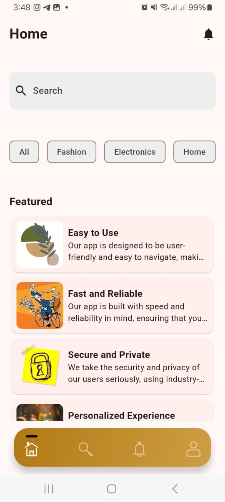

# Custom Bottom Navigation Bar with Animations

A Flutter project that implements a custom bottom navigation bar with animations, using Flutter Bloc for state management.

# Table of Contents

- [Custom Bottom Navigation Bar with Animations](#custom-bottom-navigation-bar-with-animations)
- [Table of Contents](#table-of-contents)
  - [Features](#features)
  - [Dependencies](#dependencies)
  - [Getting Started](#getting-started)
  - [Implementation Details](#implementation-details)
  - [Example Use Cases](#example-use-cases)
  - [Screenshots](#screenshots)
  - [Download](#download)

## Features

* Custom bottom navigation bar with 4 icons (Home, Search, Notifications, Profile)
* Animates between icons when tapped (scale and color animation)
* Retains the state of each page when switching between tabs

## Dependencies

* flutter_bloc
* get_it
* shimmer
* equatable
* rive

## Getting Started

To get started with the project, follow these steps:

1. Clone the repository: `git clone https://github.com/shahiduldeowan/versatilo_app.git`
2. Install the dependencies: `flutter pub get`
3. Run the app: `flutter run`

## Implementation Details

The project uses Flutter Bloc to manage the state of the bottom navigation bar. The `BottomNavBarCubit` class handles the logic for switching between tabs and animating the icons.

The `BottomNavBar` widget is a custom widget that renders the bottom navigation bar with animations. It uses the `AnimatedBuilder` widget to animate the icons when tapped.

The project also uses the `get_it` package for dependency injection and the `shimmer` package for loading animations.

## Example Use Cases

* Tap on the Home icon to navigate to the Home page
* Tap on the Search icon to navigate to the Search page
* Tap on the Notifications icon to navigate to the Notifications page
* Tap on the Profile icon to navigate to the Profile page

## Screenshots

## Download

You can download the APK directly via the following link:

[Direct Download](https://drive.usercontent.google.com/download?id=1vQB2N97YRRQcAr2eGWvewp7CtBmnz8w1&export=download&authuser=0&confirm=t&uuid=b502233d-0eec-4f61-8d0f-7d1e8bf096a7&at=AO7h07eNCMA4yadKCAHHBadcsfqR:1726910441884)
